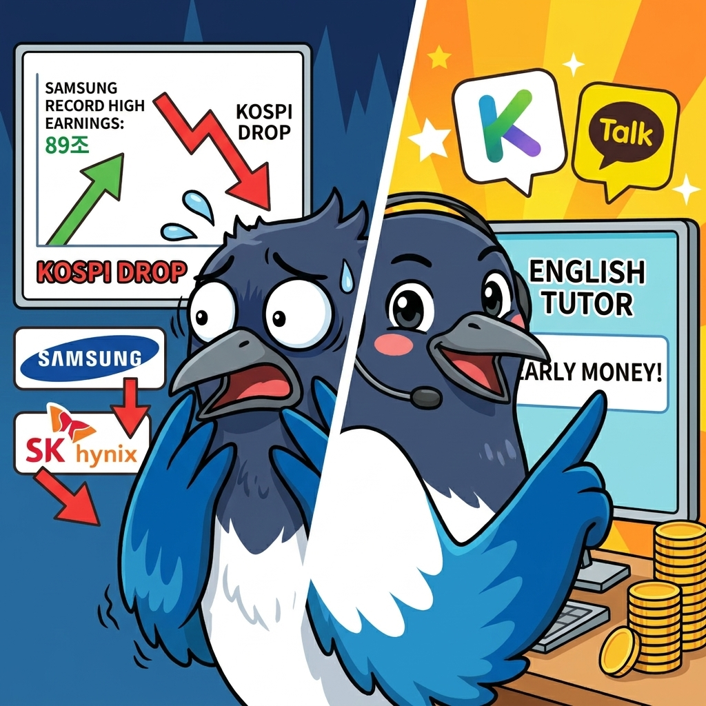
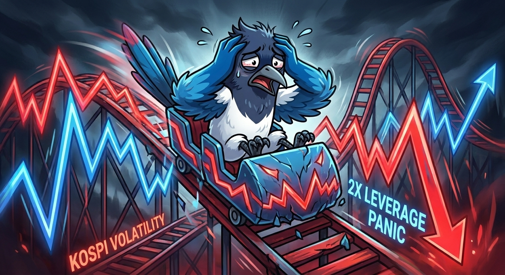
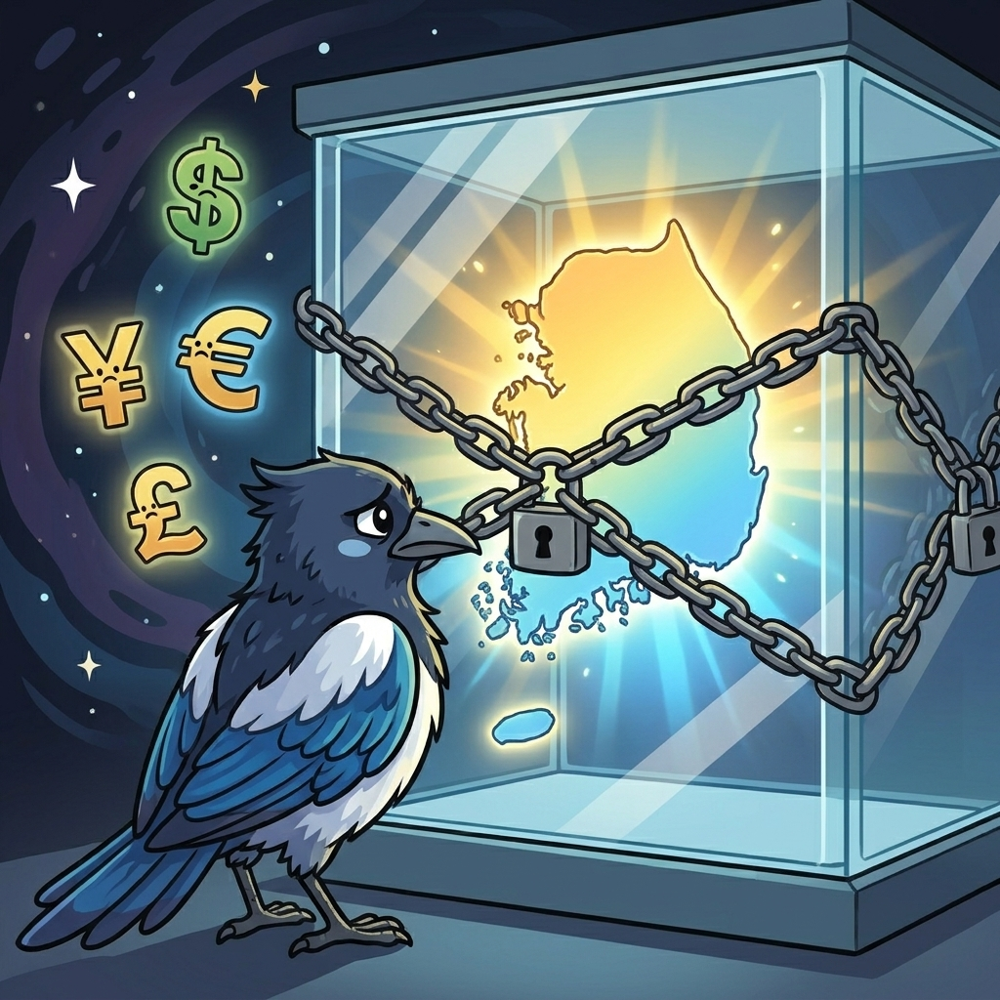

## I Hate Korean Stocks!!!

Today was the day that Samsung marked the best earnings across the world - 89조원.
However, the stocks market reflected the results in an opposite way.  

Today is also 7 July - two number 7s, so it's supposed to be a lucky day.
However, the stocks market reflected the results in an opposite way.  

You see, *I hate stocks*.  

My father started doing stocks after quitting his customs broker job in Incheon.
From then on, my mother started working as a restaurant owner in Singapore.
Maybe it's not the stocks market that I hate, but it's the Korean stocks market that I am not in favour.

## Problems with Korean Stocks Market

### 1. Volatility

KOSPI (Korea Composite Stock Price Index) comprises of all the big companies in Korea.
That's why this index relies a lot on Samsung and SK Hynix, which are the semiconductor companies that are leading the HBM (High Bandwidth Memory) market.  
Volatility brings instability of the stocks market, which brings fear for a lot of investors (I am one of them too).
They also recently introduced 2x leverage item to stocks market, which is now bringing a very negative sentiment as many investors there are losing their investments.
Personally, I also agree with the majority that this should be removed. I'm not sure where it'll go.  

### 2. Lack of Diversity

This has been an ongoing problem with the Korean economy. We have economic structure, where certain huge companies (also known as 대기업) are responsible for the Korean economy.
That's why there is this word in Korean called 삼성공화국 (Samsung Republic), referring to South Korea. Once Samsung goes down, the whole country is expected to go down.
I don't deny that Samsung is a great company. I use Samsung A54 for my mobile phone, and I've loved it so far.
Yet the fact that the Korean economy relies so much on certain big companies, and their owners - 재벌 (chaebol), I feel like there's something wrong with it.  

This is actually one main reason why I want to leave Korea. I feel like it's not really stable to live in Korea, and the economy can always collapse any time.
There is no safety net or promise that the economy will stand still.
In Germany, there are many middle-sized companies (Mittelstand) that support the German economy. So even if one company goes bankrupt, the country won't go down that easily.

### 3. Lack of Access to Global Audience

Last but not least, there's an issue with **lack of access to foreigners** who would like to trade stocks in the Korean stocks market.
I'm sure that Korean stocks gain lots of interest globally. But have you actually heard about someone who talks about Korean company?
It's almost impossible for foreigners to trade stocks in the Korean stocks market.
This is why I feel that the Korean stocks are undervalued (also known as *Korea discount*), as there's no appealing factor to the global audience.

I listed 3 issues here, but there are actually many more - which I'll maybe think of and continue yapping on another post.

## How I Feel Now
Despite the issues with the Korean stocks market, I have some hope in our Korean stocks market, or at least for Samsung and SK Hynix.  
Not only because I'm an investor on both stocks, it's also because I believe in my president. It's just been one year and he managed to pull the KOSPI value trifold upwards.
Yes, I'm being political here - I always feel that good economy comes with good politics.
That means good economy comes with great leadership, and I feel that our Korean president is doing a good job in this, and I trust him for that.
However, this will be a long-term goal to grow my assets in the background. I feel that I should act now to make some positive changes in my life.  

### Side Job as an English Tutor?

So I was thinking of having a side income, apart from my current job that deals with Marketing at 8 Birds travel agency.  
One was actually to develop this blog into a tech & life blog, so that my posts can be animated with images and videos, with the help of AI.
Besides this, I wanted to do something that I can actually earn some pocket money (용돈).
For this, I'm planning to work as an English tutor (영어 과외).  

### At Where?
It was not possible for me to work in academies (학원) because their working hours didn't fit my working schedule, from 9:30 till 17:30.
I would like to therefore try uploading my profile on 숨고. It's like a platform where I can list myself as a tutor.
This is where I think I can work as an English tutor after finishing my work on weekdays, or even on weekends.
This way I think I can get some pocket money to get nice foods, and also develop my blog into a good business in the future.  

### Other Stuffs...
I've had headache last few days, and also suffered from cold with sore throat and cough.
My feet are still in pain, so I should continue to ice them with the frozen bottle.
Health is really important so I really should take care of it, but it's so shitty that I have to maintain my diabetic status until my next health check-up...
Until then, I hope to write a lot and really keep this going.