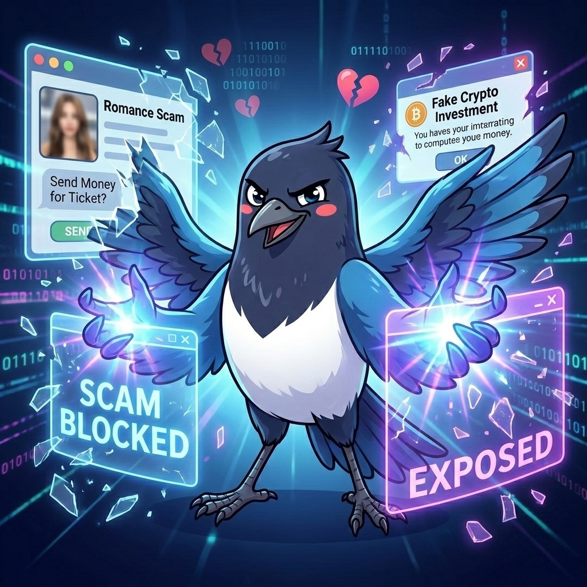
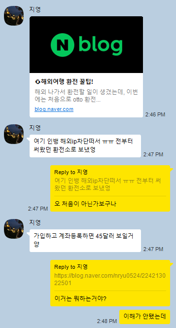
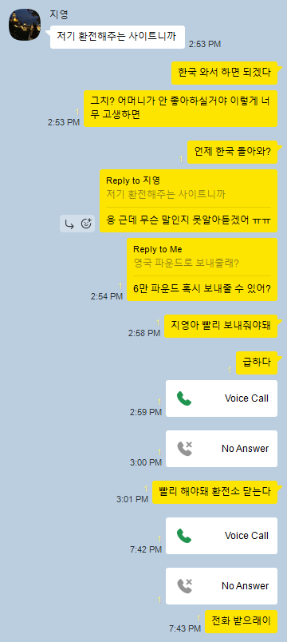

## Online dating..

I've been using different online dating apps in Korea. As a joke, I tell my friends regularly that I use dating apps as like a **dating simulation game**. Well, it was really like playing a game a couple of years ago.

So far, I've used MEEFF, Bumble regularly. Only recently I tried apps like Tinder, NoonDate (정오의데이터), WIPPY (위피) and GLAM (글램).

### Problem with online dating

The biggest problem with online dating is that there are too many scam profiles.  
Another bigger problem is that the app developer doesn't seem to care so much to get rid of scams/fake profiles.  
Either this is because it is related to data privacy and hard to catch the users.  
At most we can do to prevent "catfishing" and all other scammer profiles, is to find that "Verified" icon in their profiles.

### Why I find dating difficult in Korea
I find it particularly hard to find someone to date in Korea.  
In Germany, I would say it was easier to find someone to date, thanks to the following reasons:
* The women in Germany were more generous. I could get some matches and chat with them! 
* Korean (or even Asian) guys are rising in popularity.
* They are quite innocent as compared to Korean guys. Also more direct and straightforward when expressing emotions.
* (With all of these) I could show that I'm a normal guy as compared to others, and that was a charming feature for them.

In Korea, this was not really the case, simply because I was just like all other Korean guys.  
Nothing special, just "one of them" - there was nothing standing out and I didn't have anything to really flaunt to get the attention.  
Honestly, this was also the case in Germany - I don't think I had like a spectacular profile as compared to other guys. I know myself that I'm not like some handsome dude from K-drama or like a K-Pop artist.  
The only thing that might be attractive from me would be a personality and some eccentricity when it comes to certain topics, which are a little bit out of the box. Not too much, but a little bit.
Sometimes, we just need a bit of craziness in our lives to keep things going.  

### I don't want to pay for dating app (yet)
I heard that male users tend to be quite frugal when it comes to spending money online.
This is especially the case for K-Pop: you see a lot of female fans, but only a fraction is male, and they don't spend so much cash on their artists.  
It's probably about how passionate they are when it comes to supporting their artists.  
In a similar way, I am not really in favour of spending money for (getting a) girl. It is like a strange philosophy I have when it comes to dating - but I feel that the relationship becomes really transactional when there's cash involved in dating app.  
For me, love is something that comes naturally, and although I don't believe in things like fate, I believe there's an element of luck involved here.  
That means at the right time, your loved one will appear - it's nothing to rush, not something to be anxious about.  
It might appear out of the blue and you might find it like next day, or next year, or after 5 years.

## Romance scam

Honestly, the biggest problem with online dating, in my opinion, is **romance scam**.  
I'm not sure if anyone who's reading this has encountered romance scam. So I would like to share my first encounter with a romance scam to give you a good overview.

### Chinese girl on LINE
So there was this Chinese girl I found from MEEFF, who was a little older than me, but we were chatting and it got romantic over time.  
This is one dangerous thing about romance scam - it gives you an illusion as if this person is real, making you feel at ease and comfortable talking to the person. They tell you about their daily lives without you asking, making the conversation feel very personal.  
However, there were some things that I found from her (or him) that didn't make much sense to me.  
This person claimed that she was from Singapore as a financial analyst or something, but she couldn't speak English, although Singapore uses English as their national language.  

She shared one photo with me, driving at the expressway with like small trees that you will never see in Singapore. More importantly, in Singapore, you drive on the **right side** like in UK/Japan, but this girl was driving on the **left side**.  
That's where I got this person, and I was quite sad that the perpetrator continued to lie. I was telling this person about what I found that seemed off to me. She then got angry with the fact that I was being suspicious, and left the chatroom.

### Some common features of romance scams (on MEEFF)
There were numerous encounters with fake profiles and romance scams that I just ignored, because they're so obvious.  
Here are some things to take note if you're not sure:
* The person in the photo is **too handsome/pretty**. Let's think about it logically - do you think they're on this app to date, or dating someone IRL already? Also, do you think you're worthy of such attention?
* The photos are taken **by another person**, and **no selfies**. Most likely, this person's photo is from an influencer or a celebrity that we don't know.
* They want something sexual and put their social ID. A lot of scammers use the same platform that doesn't require authentication, and for that, they use LINE or Telegram - it becomes very convenient for them.
* They use awkward language. Easy - you can tell that they're using translator to chat with you.  
* They ask for money. Another very easy way to catch if this person is a scammer or a friend. An online friend **never** asks for money! If there's such friend, you need to cut him/her off as well!!
* They don't want to do a voice/video call with you, or even record his/her voice.

Once you can spot these features, it becomes really easy to find. This is purely based on my personal experience, and there may be more methods to find them out.

### I encountered a Korean scammer on Kakaotalk!
Yeah, and recently, there was someone who was hard to catch even though I screened through those features from this scammer. There is another way to find out if the person is scamming you or not, through [Reverse Image Search](https://www.duplichecker.com/reverse-image-search.php).  
This can come in handy when you're not sure if the person's photo is taken from online. Of course, it doesn't always work - there are premium features but I've never paid for such app, although I'm tempted to do so whenever I encounter scammer like this. 
So this time, because MEEFF added this feature where we cannot screenshot photos. A way to go around with this is to use an App player on desktop and taking a screenshot of the App player window, but I was too lazy to do this.
I wanted to see where this conversation would lead me to. Could this person be real? Of course, my dream was shattered yesterday, with some images that the scammer shared with me - they didn't make sense and yesterday, this person shared some currency exchange link that.

### Should I report this to police?
*Yes*. I find this encounter actually quite alarming, especially because this person made the experience feel very relatable for typical local Koreans. I am not sure if this person is actually a Korean or a non-Korean that speaks Korean really fluently.  
Whoever the person is, I'm not that interested - but I realised that it's important to report this to police so that other people will not be affected by this scammer. If I haven't had a long dating simulation game experience, this could have made me feel devastasted.

## I really want a girlfriend

These days I feel that I really want a girlfriend, simply because I don't have one right now - but what's more important for me is about sharing the moments together with someone, rather than spending them alone.  
Right now I feel that a lot of times are dedicated to myself. Honestly this is also good because I have all the resources focused on me. I am not spending them elsewhere, and because I have a family matter, work and also things like career development for my future (e.g. German, developing my portfolio), I feel that being solitary is not necessarily a bad thing.  
Nevertheless, I *really* want someone next to me that I could show love. I'm a type of lover who loves reactions from showing love, rather than being loved.  
When I see some videos or images of a woman being in love with a man, she just constantly stares at him, like she adores him. So far I've not had this kind of stare in my life. Until now, I feel like I've not had anyone who loved me sincerely.  

### But I want a Korean girlfriend..
I was wondering why I want a Korean girlfriend among all nationalities. I'm like *Pitbull*, *Mr. Worldwide*.  
One main reason why I want to date a Korean girl is because of the language. I feel so much at ease when I speak Korean.  
Another reason is because Korean girls are so damn pretty. I find them really attractive on the streets or in the subway, they're like some models walking around that I wish to *just ask for their IG* (but that will never happen since I'm introverted as hell).
So somehow, I have not had the chance to date a woman of my own ethnicitiy. I find Korean girls the most difficult to date, simply because they don't give me a chance at all for me to even meet up.  
After meeting up, I am quite confident to make it go on, because I don't think I'm very bad when it comes to talking to girls (except for one time in Lisbon). Therefore, once I can get a chance, I'll seize that moment. *Carpe diem*.

## What should I do then?
Yeah, I wanna date, but what can I do to turn this to reality?  
The most important aspect to focus right now is self-development. For this, it could be something related to saving up cash, grooming up for a better fashion sense, and feeling more healthy.  
Right now I don't post anything on my Instagram because I don't find myself that beautiful in terms of appearance. So only when I show myself confidently on social media, then I can really find someone too - very superficial, yes, but I also want a good-looking woman.  
For that she would also want me to be a healthy, good-looking lad - I'm very aware of that.  

One thing I'm trying to do is to lose weight and also get my liver in a better state. I feel so tired when I come back home and I don't feel like doing anything.  
When I'm outside, this isn't really the case - I still have a bit of energy to do things.  
For the next 2 months, due to my new student, I won't really have time on weekdays, but afterwards, I wanna achieve some milestones that I have - like a driver's license, exercising regularly, learning German, and a SQLD certificate (if I have time).  

So, *carpe diem!* Glow up is a hard journey, but I hope it's worth it at the end to find my bride.. hopefully.