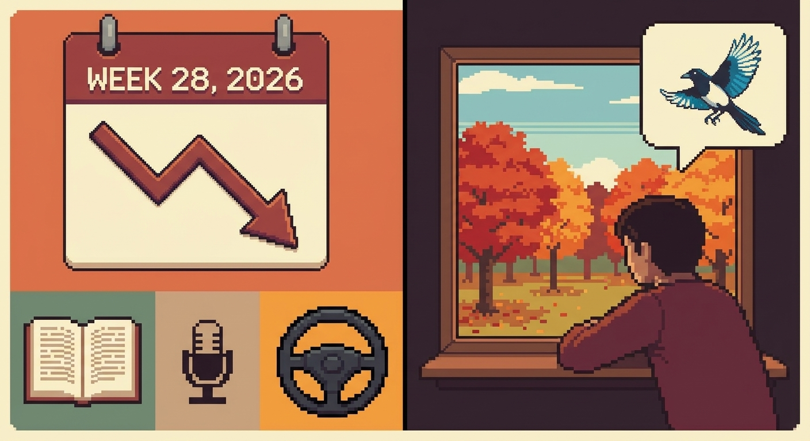

## A Week Has Passed

Finally, the Monday blues arrived, and I was feeling drowsy at work again.  
The Korean stocks market doesn't seem any good as well. Today it marked -15% for my dear SK Hynix stocks.  

## Nevertheless

I met my mom, my aunt and her family at my aunt's place in Pyeongtaek this weekend.  
We spent time watching movies, football, arguing about what Woni from Rescene said about "museop-no", which was a controversy that was labelling her as a part of Ilbe (일베), which is a far-right community in Korea.  
Whatever the conclusion was, I felt that this was too much of a witch-hunting on Woni, who was born and raised in Geoje, which is near Tongyeong, where my mom and aunt were raised in as well.  
Anyhow, one of my next travel destinations is actually Geoje - I want to bring my mom and grandmother there and enjoy our time.  

## Before The Meeting

I was actually not feeling that well. I had canker sore on my tongue and it was getting on my nerves (literally). I had to get an Albothyl from the pharmacy to cure it faster, although I had some medicine from Germany.  
Although the medicine from Germany was quite good in getting the canker sore numb, it was only temporary. How Albothyl works is that it chemically burns the affected parts.  
This heals up much quicker, but the only side-effect is that it is more painful at the start.  
Last time it was more concentrated and I heard that the pH was like 0.6. After applying it, I could see my canker sore turning white, and that was rather relieving to see.  

## How I Felt

So now I am backtracking, or maybe *backfilling* - I am just writing the series of events backwards, like how in data engineering, this is like filling up the data from current to past periods, to update the data that hasn't been updated with a new updated code. That is called *backfilling*.  
This happens quite often in the industry when it comes to orchestraton, which I also did when I was using Airflow.  
In my previous post, I mentioned that I wanted to get an English tutor job from Sumgo (숨고), so I sent out my quotation/application (견적서) to the people who requested it. Not sure if my charge was too high, but they didn't respond to my offer.  
Therefore, I decided to lower the cost and sent my revised quotations.  

## How To Teach English

I am still not sure about this. How am I supposed to teach English? My uncle-in-law however, told me and my brother something about how he worked as an English tutor when he came back from The States to Korea.  
He worked diligently to earn, almost everyday and until the night. He told us that his grammar wasn't really good, but how he showed them that he's capable of teaching, was through confidence that he lived in The States and he can speak better English than the ones in the room he was teaching in.  
I felt that this was quite phenomenal. Why should I be afraid of the students who didn't even live abroad? I did that and I made amazing friends, and I'm still meeting friends. In fact, I might be flying to Singapore for my friend's wedding in September.  
There was no reason to feel down or feel less confident about myself. This side job is therefore more like a challenge to myself to face the inner fear, and be more vocal.  
It's a completely new job that I've never tried, but I feel that I am more capable of teaching than many other tutors.  

## Driver's License

Other than that, I asked my mom about driver's license. She wanted me and my brother to get one, and she also told us that she can pay us.  
I mean, it was never about the cost that stopped us from getting it. It's more like laziness. I also felt kinda afraid that I won't be able to get one.  
Yet I should challenge myself to get one and make sure to get it. Honestly, rather than getting a license for manual driving, I want to get one for automatic, as I feel that it might be too tough for me to get one.  

## Demotivated

I do feel demotivated at times. There is always a reason to feel demotivated - I feel that I'm not good enough, like an imposter syndrome that is kicking in quite frequently.  
No matter how I tell myself that this is not true, I can't help myself to feel down. There are many things that I want to do, but there's a limited time and lack of self-discipline to get through this laziness to do something productive.  

## Trip Back To Seoul
When my aunt was driving me and my brother back to Seoul (she had another appointment in Seoul), we discussed shortly about reading books.  
I told her that I don't feel like watching YouTube because they're not that entertaining anymore, as if the recommendation algorithm got worse.  
My aunt told us that she watches them and reads less, because reading takes too much effort. I agreed with her.  
Reading makes me feel intellectual, as if I achieved something when I finish a book as well. It's somewhat like running, which I hate to do it before doing it, but while running and after finishing, it's relieving and I feel proud of myself for finishing it, just that reading takes a much longer time.  
Time gets too precious these days, and it feels like I need to optimise it, otherwise it goes to waste - but let's think about it, have we ever felt like we spent time efficiently in normal lives?  
Most of the time we regret not spending the time well in many aspects of life, wanting to go back in time and do different things.  
Humans crave for having more time to do different things, but it's like a resource curse (자원의 저주) - once you are in abundance of something, you take it for granted.  

## Another Week Has Passed
Week 28, 2026. Another week has passed. It's a hot summer day and I am yearning for my favourite season, autumn.  
I made a new background image for my hemukase to be more vibrant with colours.  
Again, another week has passed, and as time passes, I miss my old self when I worked with gratitude.  
I wish one day I could work as a data engineer again to relive the happy moments.  
Until then, I'll have to make a step forward to be competent in the market. I wish myself the best.  